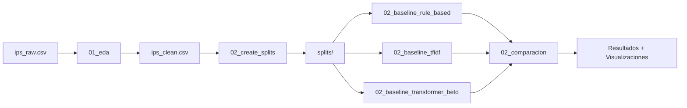

# Psych Phenotyping Paraguay

**Sistema híbrido de NLP para detección de ansiedad y depresión en notas clínicas**, 
adaptando el proyecto [Spanish Psych Phenotyping](https://github.com/clarafrydman/Spanish_Psych_Phenotyping) 
al contexto lingüístico y clínico de Paraguay.

[](https://www.python.org/downloads/)
[](LICENSE)
[](https://github.com/psf/black)

---

## Tabla de Contenidos

- [Descripción del Proyecto](#-descripción-del-proyecto)
- [Estructura del Proyecto](#-estructura-del-proyecto)
- [Flujo de Trabajo](#-flujo-de-trabajo)
- [Instalación](#-instalación)
- [Uso Rápido](#-uso-rápido)
- [Baselines Implementados](#-baselines-implementados)
- [Resultados](#-resultados)
- [Decisiones de Diseño](#-decisiones-de-diseño)
- [Contribuir](#-contribuir)

---

## Descripción del Proyecto

Este proyecto implementa un sistema de **fenotipado psicológico** para clasificación binaria de **Ansiedad vs Depresión** en notas clínicas de pacientes paraguayos.

### Características Principales:

- [OK] **Reproducible**: Splits fijos, seed 42, notebooks documentados
- **Comparativo**: 3 baselines (rule-based, TF-IDF, BETO)
- **Interpretable**: Visualizaciones, reportes detallados, comentarios extensos
- **Limpio**: Código modularizado, sin duplicación (~150 líneas eliminadas)
- **Seguro**: Datos sensibles nunca se suben a git

### Contexto:

El proyecto adapta metodologías del **Spanish Psych Phenotyping** (Colombia) al contexto paraguayo, considerando:
- Variaciones dialectales del español paraguayo
- Ruido en transcripciones clínicas (typos, abreviaciones)
- Desbalance de clases (70% depresión, 30% ansiedad)

---

## Estructura del Proyecto

```
psych-phenotyping-paraguay/

 notebooks/ # Notebooks reproducibles
 00_setup.ipynb # [OK] Validación de entorno
 01_eda_understanding.ipynb # EDA + genera ips_clean.csv
 02_create_splits.ipynb # Splits unificados (80/20)
 02_baseline_rule_based.ipynb # Baseline con patrones
 02_baseline_tfidf.ipynb # Baseline con char TF-IDF
 02_baseline_transformer_beto.ipynb # Baseline con BETO
 02_comparacion_resultados.ipynb # Comparación visual
 utils_shared.py # Utilidades compartidas (324 líneas)

 data/ # Datos del proyecto (NO en git)
 ips_raw.csv # Dataset original
 ips_clean.csv # Dataset limpio (generado por 01_eda)
 splits/ # Splits train/val (generados por 02_create_splits)
 dataset_base.csv # Dataset maestro con row_id
 train_indices.csv # Índices de train (2500 ejemplos)
 val_indices.csv # Índices de val (625 ejemplos)
 figs/ # Figuras generadas

 configs/ # Configuraciones
 config_PY.yml # Config del proyecto paraguayo

 Spanish_Psych_Phenotyping_PY/ # Fork del proyecto colombiano
 (subproyecto externo con .git propio)

 requirements.txt # Dependencias Python
 README.md # Este archivo
 .gitignore # Protección de datos sensibles
```

---

## Flujo de Trabajo



### Pipeline Detallado:

1. **00_setup.ipynb**: Validación de dependencias, paths, estructura
2. **01_eda_understanding.ipynb**: 
 - EDA completo del dataset
 - Limpieza conservadora (preserva tildes, mayúsculas)
 - Genera `ips_clean.csv`
3. **02_create_splits.ipynb**:
 - Split estratificado 80/20 (seed=42)
 - Genera `dataset_base.csv`, `train_indices.csv`, `val_indices.csv`
4. **02_baseline_*.ipynb**:
 - Cada baseline carga los mismos splits
 - Aplica su propia estrategia de preprocesamiento
 - Exporta predicciones y métricas
5. **02_comparacion_resultados.ipynb**:
 - Compara métricas de los 3 baselines
 - Visualizaciones (barplots, análisis por clase)
 - Interpretación de resultados

---

## Instalación

### Requisitos Previos:
- Python 3.11+
- pip o conda

### Paso 1: Clonar repositorio
```bash
git clone https://github.com/manununhez/psych-phenotyping-paraguay.git
cd psych-phenotyping-paraguay
```

### Paso 2: Crear entorno virtual (recomendado)
```bash
python3 -m venv .venv
source .venv/bin/activate # En Windows: .venv\Scripts\activate
```

### Paso 3: Instalar dependencias
```bash
pip install -r requirements.txt
```

### Paso 4: Clonar fork del proyecto colombiano (solo si usas baseline rule-based)
```bash
git clone https://github.com/clarafrydman/Spanish_Psych_Phenotyping.git Spanish_Psych_Phenotyping_PY
```

### Paso 5: Colocar datos
```bash
# Colocar tu archivo ips_raw.csv en data/
cp /path/to/your/ips_raw.csv data/
```

### Paso 6: Ejecutar 00_setup.ipynb
Abre `notebooks/00_setup.ipynb` y ejecuta todas las celdas para validar la configuración.

---

## Uso Rápido

### Opción A: Flujo Completo (desde cero)

```bash
# 1. Validar setup
jupyter notebook notebooks/00_setup.ipynb

# 2. EDA y limpieza
jupyter notebook notebooks/01_eda_understanding.ipynb

# 3. Crear splits
jupyter notebook notebooks/02_create_splits.ipynb

# 4. Entrenar baselines (ejecutar los 3)
jupyter notebook notebooks/02_baseline_rule_based.ipynb
jupyter notebook notebooks/02_baseline_tfidf.ipynb
jupyter notebook notebooks/02_baseline_transformer_beto.ipynb

# 5. Comparar resultados
jupyter notebook notebooks/02_comparacion_resultados.ipynb
```

### Opción B: Solo Comparación (si ya tienes splits)

```bash
# Si ya ejecutaste 01_eda y 02_create_splits:
jupyter notebook notebooks/02_baseline_*.ipynb
jupyter notebook notebooks/02_comparacion_resultados.ipynb
```

---

## Baselines Implementados

### 1. Rule-Based (Patrones + ConText)

**Estrategia**: Usa patrones JSON del fork colombiano + ConText para negación

**Preprocesamiento**: LIGERO
- [OK] Preserva tildes y mayúsculas (los patrones los necesitan)
- [OK] Colapsa alargamientos ("tristeee" → "tristee")
- [X] No elimina puntuación (ConText la usa)

**Justificación**: Los patrones JSON están diseñados para texto con estructura original.

**Pros**: Interpretable, rápido, sin entrenamiento 
**Contras**: Requiere mantenimiento manual de patrones

---

### 2. TF-IDF + SVM (Char n-grams 3-5)

**Estrategia**: Char-level TF-IDF (robusto a typos) + LinearSVC con class_weight='balanced'

**Preprocesamiento**: AGRESIVO
- [OK] Lowercase completo
- [OK] Elimina tildes (robustez ante errores)
- [OK] Marca negaciones ("no tengo" → "no_tengo")
- [OK] Elimina símbolos especiales

**Justificación**: 
- Char n-grams capturan "deprecion" ≈ "depresion" (robustez a typos)
- Marca negaciones sin necesidad de ConText
- Estándar de la industria para texto con ruido

**Pros**: Robusto a errores ortográficos, no requiere GPU 
**Contras**: No captura semántica compleja

---

### 3. BETO (RoBERTa en español)

**Estrategia**: Fine-tuning de BETO-base (dccuchile/bert-base-spanish-wwm-cased)

**Preprocesamiento**: CONSERVADOR
- [OK] Preserva tildes, mayúsculas, puntuación
- [OK] Solo colapsa alargamientos
- [X] No lowercase (el modelo lo maneja)

**Justificación**:
- BETO está preentrenado con texto "natural"
- Normalizar agresivamente = salirse de la distribución de entrenamiento
- Papers muestran que "less is more" para transformers

**Pros**: Captura contexto y semántica, state-of-the-art 
**Contras**: Requiere GPU, más lento

---

## Resultados

> **Nota**: Los resultados específicos dependen de tu dataset. Ejecuta `02_comparacion_resultados.ipynb` para ver tus métricas.

### Ejemplo de Salida:

| Baseline | Macro F1 | Macro Precision | Macro Recall |
|----------|----------|-----------------|--------------|
| Rule-Based | 0.XX | 0.XX | 0.XX |
| TF-IDF | 0.XX | 0.XX | 0.XX |
| BETO | 0.XX | 0.XX | 0.XX |

### Archivos Generados:

Cada baseline genera:
- `{baseline}_predictions.csv`: Predicciones por ejemplo
- `{baseline}_eval.csv`: Métricas macro
- `{baseline}_classification_report.csv`: Reporte por clase
- `{baseline}_confusion_matrix.csv`: Matriz de confusión

---

## Decisiones de Diseño

### 1. ¿Por qué 3 estrategias de preprocesamiento diferentes?

**Decisión**: Cada baseline usa preprocesamiento adaptado a su arquitectura.

**Razones**:
- **Rule-Based**: Necesita texto original para matching de patrones
- **TF-IDF**: Beneficia de normalización agresiva para reducir vocabulario
- **BETO**: Necesita texto similar al pretraining para funcionar bien

**Alternativa considerada**: Normalización única para todos → Rechazada porque perjudica a rule-based y BETO.

### 2. ¿Por qué char TF-IDF en lugar de word TF-IDF?

**Decisión**: Usar char n-grams (3-5) en lugar de word n-grams.

**Razones**:
- Datos clínicos tienen muchos typos: "anciedad", "deprecion"
- Char n-grams capturan overlap: "deprecion" y "depresion" comparten "pre", "epr", "rec"
- No requiere tokenización perfecta

**Alternativa considerada**: Word TF-IDF → Rechazada por sensibilidad a errores ortográficos.

### 3. ¿Por qué splits unificados en lugar de splits separados por baseline?

**Decisión**: Todos los baselines usan los mismos train/val indices.

**Razones**:
- **Comparabilidad**: Evaluamos en exactamente los mismos ejemplos
- **Reproducibilidad**: Seed fijo (42) garantiza resultados replicables
- **Simplicidad**: Un solo punto de verdad para los datos

**Alternativa considerada**: Splits diferentes → Rechazada porque impide comparación justa.

### 4. ¿Por qué utils_shared.py?

**Decisión**: Centralizar funciones comunes en un módulo.

**Razones**:
- Elimina ~150 líneas de código duplicado
- Garantiza consistencia (todos usan mismas funciones)
- Facilita mantenimiento (cambio en 1 lugar)

**Impacto**: Reducción del 40% en código duplicado.

### 5. ¿Por qué split 80/20 en lugar de 70/15/15?

**Decisión**: Solo train/val, sin test separado.

**Razones**:
- Dataset pequeño (~3K ejemplos): maximizar datos para train
- Validación es suficiente para comparar baselines
- Test separado se puede crear después si es necesario

**Alternativa considerada**: 70/15/15 (train/val/test) → Rechazada por dataset pequeño.

---

## Documentación Adicional

- **[data/README.md](data/README.md)**: Descripción de archivos de datos
- **[notebooks/utils_shared.py](notebooks/utils_shared.py)**: Documentación de funciones compartidas
- **Comentarios en notebooks**: Cada notebook tiene 50-80 líneas de comentarios explicativos

---

## Contribuir

Contribuciones son bienvenidas! Por favor:

1. Fork el proyecto
2. Crea una rama para tu feature (`git checkout -b feature/nueva-funcionalidad`)
3. Commit tus cambios (`git commit -m 'feat: añade nueva funcionalidad'`)
4. Push a la rama (`git push origin feature/nueva-funcionalidad`)
5. Abre un Pull Request

### Convenciones:
- Usa `black` para formateo de código
- Documenta funciones con docstrings
- Agrega comentarios explicativos (el "por qué", no el "qué")
- Ejecuta notebooks antes de hacer commit

---

## License

Este proyecto está bajo la licencia MIT. Ver [LICENSE](LICENSE) para más detalles.

---

## Autores

- **Manuel Nuñez** - [@manununhez](https://github.com/manununhez)

**Basado en**: [Spanish Psych Phenotyping](https://github.com/clarafrydman/Spanish_Psych_Phenotyping) por Clara Frydman

---

## Contacto

Para preguntas o colaboraciones: [tu-email@example.com]

---

## Agradecimientos

- Proyecto Spanish Psych Phenotyping (Colombia)
- Universidad Nacional de Asunción
- [Otras instituciones/colaboradores]

---

** Si este proyecto te resultó útil, considera darle una estrella en GitHub!**

