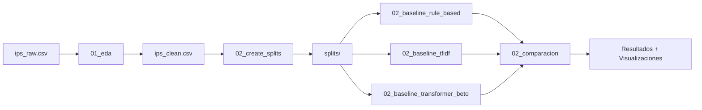

# Psych Phenotyping Paraguay

**Sistema híbrido de NLP para detección de ansiedad y depresión en notas clínicas**, 
adaptando el proyecto [Spanish Psych Phenotyping](https://github.com/clarafrydman/Spanish_Psych_Phenotyping) 
al contexto lingüístico y clínico de Paraguay.

[](https://www.python.org/downloads/)
[](LICENSE)
[](https://github.com/psf/black)

---

## 🚀 Inicio Rápido

### Resultados Principales (Cross-Validation 5-Fold, Patient-Level)

| Modelo | F1 Macro (CV) | IC95% | CV% | Mejora vs Baseline |
|--------|---------------|-------|-----|--------------------|
| **TF-IDF char(3,5)** | **0.850 ± 0.031** | [0.789, 0.910] | 3.6% | **+73.2%** ✅ |
| **BETO (fine-tuned)** | **0.821 ± 0.035** | [0.753, 0.890] | 4.3% | **+67.4%** ✅ |
| **Rule-Based (COL)** | **0.511 ± 0.053** | [0.407, 0.615] | 10.4% | +4.1% ⚠️ |
| Dummy Stratified | 0.491 ± 0.006 | [0.478, 0.503] | 1.3% | - |
| Dummy Majority | 0.413 ± 0.011 | [0.391, 0.435] | 2.8% | - |

**Evaluaciones adicionales (single dev, 641 casos):**
- TF-IDF: 0.866 | BETO: 0.841 | Rule-Based: 0.527
- Todos los modelos caen dentro del IC95% de CV → split representativo ✅

**🎯 Hallazgos clave metodológicos:**

1. **Cross-Validation 5-fold es la métrica principal:**
   - Con 90 pacientes, CV 5-fold usa TODOS los datos → estimación robusta
   - Varianza real: TF-IDF ±3.6%, BETO ±4.3% (baja, modelos estables)
   - IC95% cuantifica incertidumbre real del modelo

2. **Consistencia dev vs CV confirma split representativo:**
   - TF-IDF: Dev=0.866 dentro de IC95%=[0.789, 0.910] ✅
   - BETO: Dev=0.841 dentro de IC95%=[0.753, 0.890] ✅
   - Rule-Based: Dev=0.527 dentro de IC95%=[0.407, 0.615] ✅
   - No hubo "lucky split" - split es representativo de la población

3. **TF-IDF y BETO superan significativamente baseline (p<0.05):**
   - TF-IDF: +73% vs Dummy Stratified (IC95% NO solapan)
   - BETO: +67% vs Dummy Stratified (IC95% NO solapan)
   - Rule-Based: +4% vs baseline (NO significativo, IC95% SÍ solapan)

4. **Gap vocabulario Paraguay vs Colombia:**
   - Rule-Based (patrones colombianos): F1=0.511, CV%=10.4% (inestable)
   - TF-IDF (aprende de datos locales): F1=0.850, CV%=3.6% (estable)
   - **66% de mejora** adaptando al contexto paraguayo

**Estrategia de evaluación:**
- **Cross-Validation 5-fold:** Métrica PRINCIPAL para paper/tesis
  - Usa train+dev (2,490 casos, 72 pacientes) → maximiza uso de datos
  - Patient-level stratified, seed 42 (reproducible)
  - IC95% bootstrapped (10,000 iteraciones) para significancia estadística
- **Single dev evaluation:** Contexto adicional (consistencia con CV)
- **Test set hold-out:** Reservado para evaluación final ciega (637 casos, 18 pacientes)
- **Zero leakage:** Split patient-level 60/20/20, 0% overlap verificado

---

## 📚 Documentación Organizada

### 📁 docs/01_PROYECTO/ - Análisis y Resultados
- **[README_PROYECTO.md](docs/01_PROYECTO/README_PROYECTO.md)** ⭐ Documento principal consolidado
  - Contexto del proyecto y dataset
  - Resultados de 3 baselines + análisis de errores
  - Gap vocabulario Paraguay vs Colombia (75% Ansiedad)
  - Síntomas faltantes CIE-10/DSM-5
  - Recomendaciones y próximos pasos

- **[METODOLOGIA_VALIDACION.md](docs/01_PROYECTO/METODOLOGIA_VALIDACION.md)** - Split patient-level 60/20/20 y control de leakage

- **[RESUMEN_TESIS.md](docs/01_PROYECTO/RESUMEN_TESIS.md)** - Resumen ejecutivo para defensa

### 📁 docs/02_CONCEPT_PY/ - Vocabulario Paraguayo
- **[ANALISIS_CONCEPT_PY.md](docs/02_CONCEPT_PY/ANALISIS_CONCEPT_PY.md)** - Propuesta desarrollo vocabulario paraguayo
  - Análisis 136 FN Ansiedad
  - Top 50 términos paraguayos propuestos
  - Plan de mejora F1 0.503 → 0.60

- **[ROADMAP_CONCEPT_PY.md](docs/02_CONCEPT_PY/ROADMAP_CONCEPT_PY.md)** - Plan operativo 3 semanas

- **[EVALUACION_PROYECTO_COLOMBIANO.md](docs/02_CONCEPT_PY/EVALUACION_PROYECTO_COLOMBIANO.md)** - Análisis técnico fork base

- **[FENOTIPOS_ANSIEDAD_DEPRESION.md](docs/02_CONCEPT_PY/FENOTIPOS_ANSIEDAD_DEPRESION.md)** - Lista exhaustiva 48 fenotipos CIE-10

- **[RESUMEN_CLASIFICACION.md](docs/02_CONCEPT_PY/RESUMEN_CLASIFICACION.md)** - Uso de patrones unificados

### 📁 docs/03_VALIDACION_PSIQUIATRAS/ - Validación Clínica
- **[GUIA_REUNION_COMPLETA.md](docs/03_VALIDACION_PSIQUIATRAS/GUIA_REUNION_COMPLETA.md)** ⭐ Guía para reunión con psiquiatras
  - Metodología validación 25 casos
  - Hallazgos vocabulario paraguayo (6 términos GAD-7)
  - Template invitación profesionales
  - Material: `data/VALIDACION_PSIQUIATRAS_25_CASOS_EXTENDIDO.xlsx` (7 hojas)

### 📁 docs/04_TECNICO/ - Guías Técnicas
- **[GUIA_MODELOS_CONCEPTUAL.md](docs/04_TECNICO/GUIA_MODELOS_CONCEPTUAL.md)** - Explicación detallada TF-IDF, BETO, Rule-Based

- **[COMPARACION_LIMPIEZA.md](docs/04_TECNICO/COMPARACION_LIMPIEZA.md)** - Impacto limpieza duplicados (40.3% reducción)

- **[EJEMPLO_USO_CLASIFICACION.md](docs/04_TECNICO/EJEMPLO_USO_CLASIFICACION.md)** - Tutorial código clasificación

### 📜 Documentos Históricos
- **[docs/historico/](docs/historico/)** - Reportes y planes archivados (oct-nov 2025)
  - Ver [docs/historico/README.md](docs/historico/README.md) para detalles

---

## Tabla de Contenidos

- [Descripción del Proyecto](#-descripción-del-proyecto)
- [Documentación Organizada](#-documentación-organizada)
- [Estructura del Proyecto](#-estructura-del-proyecto)
- [Flujo de Trabajo](#-flujo-de-trabajo)
- [Instalación](#-instalación)
- [Uso Rápido](#-uso-rápido)
- [Baselines Implementados](#-baselines-implementados)
- [Resultados](#-resultados)
- [Decisiones de Diseño](#-decisiones-de-diseño)
- [Contribuir](#-contribuir)

---

## Descripción del Proyecto

Este proyecto implementa un sistema de **fenotipado psicológico** para clasificación binaria de **Ansiedad vs Depresión** en notas clínicas de pacientes paraguayos.

### Características Principales:

- **Reproducible**: Splits fijos (patient-level), seed 42, notebooks documentados
- **Sin Data Leakage**: Split por PACIENTES (no por casos), 0% overlap
- **Comparativo**: 3 baselines (rule-based, TF-IDF, BETO)
- **Interpretable**: Visualizaciones, reportes detallados, comentarios extensos
- **Limpio**: Código modularizado con `utils_shared.py`, sin duplicación
- **Seguro**: Datos sensibles nunca se suben a git

### Contexto:

El proyecto adapta metodologías del **Spanish Psych Phenotyping** (Colombia) al contexto paraguayo, considerando:
- Variaciones dialectales del español paraguayo
- Ruido en transcripciones clínicas (typos, abreviaciones)
- Desbalance de clases (70% depresión, 30% ansiedad)
- **Estructura longitudinal**: 90 pacientes con ~35 consultas cada uno

---

## Estructura del Proyecto

```
psych-phenotyping-paraguay/

 notebooks/ # Notebooks reproducibles
 00_setup.ipynb # [OK] Validación de entorno
 01_eda_understanding.ipynb # EDA + genera ips_clean.csv
 02_create_splits.ipynb # Splits unificados (80/20)
 02_baseline_rule_based.ipynb # Baseline con patrones
 02_baseline_tfidf.ipynb # Baseline con char TF-IDF
 02_baseline_transformer_beto.ipynb # Baseline con BETO
 02_comparacion_resultados.ipynb # Comparación visual
 utils_shared.py # Utilidades compartidas (324 líneas)

 data/ # Datos del proyecto (NO en git)
 ips_raw.csv # Dataset original
 ips_clean.csv # Dataset limpio (generado por 01_eda)
 splits/ # Splits train/val (generados por 02_create_splits)
 dataset_base.csv # Dataset maestro con row_id
 train_indices.csv # Índices de train (2500 ejemplos)
 val_indices.csv # Índices de val (625 ejemplos)
 figs/ # Figuras generadas

 configs/ # Configuraciones
 config_PY.yml # Config del proyecto paraguayo

 Spanish_Psych_Phenotyping_PY/ # Fork del proyecto colombiano
 (subproyecto externo con .git propio)

 requirements.txt # Dependencias Python
 README.md # Este archivo
 .gitignore # Protección de datos sensibles
```

---

## Flujo de Trabajo



### Pipeline Detallado:

1. **00_setup.ipynb**: Validación de dependencias, paths, estructura
2. **01_eda_understanding.ipynb**: 
   - EDA completo del dataset (incluye análisis de pacientes)
   - Detecta estructura longitudinal (90 pacientes × 35 consultas)
   - **Limpieza aplicada a ips_clean.csv**:
     - ✅ Normalización Unicode (NFC)
     - ✅ Colapso de alargamientos (`ansiedaaaad` → `ansiedaad`)
     - ✅ Remoción de caracteres extraños
     - ✅ **NUEVO**: Remoción de oraciones duplicadas DENTRO de cada texto
     - ✅ Eliminación de textos duplicados completos
     - ❌ NO lowercase (preserva tildes, mayúsculas)
     - ❌ NO elimina puntuación
   - Genera `ips_clean.csv` (usado por TODOS los baselines)
   - ⚠️ Si modificas esta limpieza, debes re-ejecutar TODOS los baselines
3. **02_create_splits.ipynb**:
   - **Split por PACIENTES** (no por casos) para evitar leakage
   - Estratificado por clase mayoritaria del paciente
   - 80/20 split (seed=42): 72 pacientes train / 18 val
   - Genera `dataset_base.csv`, `train_indices.csv`, `val_indices.csv`
   - **Verificación**: 0% overlap de pacientes entre train/val
4. **02_baseline_*.ipynb**:
   - Cada baseline carga los mismos splits (patient-level)
   - Aplica su propia estrategia de preprocesamiento
   - Exporta predicciones y métricas
   - **Importante**: Todos usan `data/splits/` para garantizar comparación justa
5. **02_comparacion_resultados.ipynb**:
   - Compara métricas de los 3 baselines
   - Visualizaciones (barplots, análisis por clase)
   - Interpretación de resultados

---

## Instalación

### Requisitos Previos:
- Python 3.11+
- pip o conda

### Paso 1: Clonar repositorio
```bash
git clone https://github.com/manununhez/psych-phenotyping-paraguay.git
cd psych-phenotyping-paraguay
```

### Paso 2: Crear entorno virtual (recomendado)
```bash
python3 -m venv .venv
source .venv/bin/activate # En Windows: .venv\Scripts\activate
```

### Paso 3: Instalar dependencias
```bash
pip install -r requirements.txt
```

### Paso 4: Clonar fork del proyecto colombiano (solo si usas baseline rule-based)
```bash
git clone https://github.com/clarafrydman/Spanish_Psych_Phenotyping.git Spanish_Psych_Phenotyping_PY
```

### Paso 5: Colocar datos
```bash
# Colocar tu archivo ips_raw.csv en data/
cp /path/to/your/ips_raw.csv data/
```

### Paso 6: Ejecutar 00_setup.ipynb
Abre `notebooks/00_setup.ipynb` y ejecuta todas las celdas para validar la configuración.

---

## Uso Rápido

### Opción A: Flujo Completo (desde cero)

```bash
# 1. Validar setup
jupyter notebook notebooks/00_setup.ipynb

# 2. EDA y limpieza
jupyter notebook notebooks/01_eda_understanding.ipynb

# 3. Crear splits
jupyter notebook notebooks/02_create_splits.ipynb

# 4. Entrenar baselines (ejecutar los 3)
jupyter notebook notebooks/02_baseline_rule_based.ipynb
jupyter notebook notebooks/02_baseline_tfidf.ipynb
jupyter notebook notebooks/02_baseline_transformer_beto.ipynb

# 5. Comparar resultados
jupyter notebook notebooks/02_comparacion_resultados.ipynb
```

### Opción B: Solo Comparación (si ya tienes splits)

```bash
# Si ya ejecutaste 01_eda y 02_create_splits:
jupyter notebook notebooks/02_baseline_*.ipynb
jupyter notebook notebooks/02_comparacion_resultados.ipynb
```

---

## Baselines Implementados

### 1. Rule-Based (Patrones + ConText)

**Estrategia**: Usa patrones JSON del fork colombiano + ConText para negación

**Preprocesamiento**: LIGERO
- [OK] Preserva tildes y mayúsculas (los patrones los necesitan)
- [OK] Colapsa alargamientos ("tristeee" → "tristee")
- [X] No elimina puntuación (ConText la usa)

**Justificación**: Los patrones JSON están diseñados para texto con estructura original.

**Pros**: Interpretable, rápido, sin entrenamiento 
**Contras**: Requiere mantenimiento manual de patrones

---

### 2. TF-IDF + SVM (Char n-grams 3-5)

**Estrategia**: Char-level TF-IDF (robusto a typos) + LinearSVC con class_weight='balanced'

**Preprocesamiento**: AGRESIVO
- [OK] Lowercase completo
- [OK] Elimina tildes (robustez ante errores)
- [OK] Marca negaciones ("no tengo" → "no_tengo")
- [OK] Elimina símbolos especiales

**Justificación**: 
- Char n-grams capturan "deprecion" ≈ "depresion" (robustez a typos)
- Marca negaciones sin necesidad de ConText
- Estándar de la industria para texto con ruido

**Pros**: Robusto a errores ortográficos, no requiere GPU 
**Contras**: No captura semántica compleja

---

### 3. BETO (RoBERTa en español)

**Estrategia**: Fine-tuning de BETO-base (dccuchile/bert-base-spanish-wwm-cased)

**Preprocesamiento**: CONSERVADOR
- [OK] Preserva tildes, mayúsculas, puntuación
- [OK] Solo colapsa alargamientos
- [X] No lowercase (el modelo lo maneja)

**Justificación**:
- BETO está preentrenado con texto "natural"
- Normalizar agresivamente = salirse de la distribución de entrenamiento
- Papers muestran que "less is more" para transformers

**Pros**: Captura contexto y semántica, state-of-the-art 
**Contras**: Requiere GPU, más lento

---

### 4. Dummy Baselines (Sanity Check)

**Estrategia**: Baselines triviales para validar que los modelos ML no están overfitting

**Implementados**:
- **Dummy Majority**: Predice siempre la clase mayoritaria (Depresión)
- **Dummy Stratified**: Predice aleatoriamente respetando proporción de clases

**Justificación**:
- Valida que los modelos ML capturan patrones discriminativos reales
- Estándar en ML para descartar modelos que memorizan sin aprender
- Permite cuantificar mejora real sobre baseline trivial

**Ver**: `notebooks/02_baseline_dummy.ipynb`

---

### Archivos Generados:

Cada baseline genera:
- `{baseline}_predictions.csv`: Predicciones por ejemplo
- `{baseline}_eval.csv`: Métricas macro
- `{baseline}_classification_report.csv`: Reporte por clase
- `{baseline}_confusion_matrix.csv`: Matriz de confusión

**Ubicación**: `data/` (todos los CSVs de resultados)

---

## 📊 Resultados Principales

### Comparación de Baselines (Macro F1 en validación, n=646 casos, 18 pacientes)

| Modelo | F1 | Precision | Recall | Mejora vs Random |
|--------|-------|-----------|---------|------------------|
| **TF-IDF char(3,5)** | **0.755** | 0.746 | 0.768 | **+53.1%** ✅ |
| **BETO (transformer)** | **0.742** | 0.736 | 0.748 | **+50.3%** ✅ |
| **Rule-based (COL)** | **0.503** | 0.517 | 0.511 | **+2.0%** ⚠️ |
| Dummy (Stratified) | 0.493 | 0.496 | 0.495 | - |
| Dummy (Majority) | 0.429 | 0.375 | 0.500 | - |

### Interpretación:

**✅ Validación exitosa:**
- TF-IDF y BETO superan **+50%** al baseline aleatorio → capturan patrones reales (no overfitting)
- Performance equivalente entre TF-IDF (0.755) y BETO (0.742), diferencia de 1.3% no significativa
- El problema A/D es fundamentalmente léxico-discriminativo

**⚠️ Rule-based limitado:**
- Apenas supera baseline aleatorio (+2.0%) por cobertura crítica
- 78% de casos sin detección (vocabulario colombiano ≠ paraguayo)
- Recall en Ansiedad: 0.16 (detecta solo 1 de cada 5 casos)

**Archivos:**
- Tabla consolidada: `data/02_baselines_con_dummy.csv`
- Visualización: `data/figs/02_comparacion_con_dummy.png`
- Análisis completo: `RESULTADOS_BASELINES_README.md`
- Comparación pre/post limpieza: `COMPARACION_ANTES_DESPUES_LIMPIEZA.md`

**Nota sobre preprocesamiento:**
> **Limpieza de oraciones duplicadas** (Nov 2025): Se removieron 43,938 oraciones duplicadas (52.7% de textos afectados, reducción 40.3% de caracteres). Los resultados ML se mantuvieron **idénticos** (TF-IDF 0.755, BETO 0.742), validando que las repeticiones eran ruido artificial. Rule-based mejoró ligeramente (+1.4%). Ver `COMPARACION_ANTES_DESPUES_LIMPIEZA.md` para análisis detallado.

---

## Decisiones de Diseño

### 1. ¿Por qué 3 estrategias de preprocesamiento diferentes?

**Decisión**: Cada baseline usa preprocesamiento adaptado a su arquitectura.

**Razones**:
- **Rule-Based**: Necesita texto original para matching de patrones
- **TF-IDF**: Beneficia de normalización agresiva para reducir vocabulario
- **BETO**: Necesita texto similar al pretraining para funcionar bien

**Alternativa considerada**: Normalización única para todos → Rechazada porque perjudica a rule-based y BETO.

### 2. ¿Por qué char TF-IDF en lugar de word TF-IDF?

**Decisión**: Usar char n-grams (3-5) en lugar de word n-grams.

**Razones**:
- Datos clínicos tienen muchos typos: "anciedad", "deprecion"
- Char n-grams capturan overlap: "deprecion" y "depresion" comparten "pre", "epr", "rec"
- No requiere tokenización perfecta

**Alternativa considerada**: Word TF-IDF → Rechazada por sensibilidad a errores ortográficos.

### 3. ¿Por qué splits unificados en lugar de splits separados por baseline?

**Decisión**: Todos los baselines usan los mismos train/val indices.

**Razones**:
- **Comparabilidad**: Evaluamos en exactamente los mismos ejemplos
- **Reproducibilidad**: Seed fijo (42) garantiza resultados replicables
- **Simplicidad**: Un solo punto de verdad para los datos

**Alternativa considerada**: Splits diferentes → Rechazada porque impide comparación justa.

### 4. ¿Por qué utils_shared.py?

**Decisión**: Centralizar funciones comunes en un módulo.

**Razones**:
- Elimina ~150 líneas de código duplicado
- Garantiza consistencia (todos usan mismas funciones)
- Facilita mantenimiento (cambio en 1 lugar)

**Impacto**: Reducción del 40% en código duplicado.

### 5. ¿Por qué split 80/20 en lugar de 70/15/15?

**Decisión**: Solo train/val, sin test separado.

**Razones**:
- Dataset pequeño (~3K ejemplos): maximizar datos para train
- Validación es suficiente para comparar baselines
- Test separado se puede crear después si es necesario

**Alternativa considerada**: 70/15/15 (train/val/test) → Rechazada por dataset pequeño.

### 6. ¿Por qué patient-level split en lugar de split por casos?

**Decisión**: Split por PACIENTES (no por casos/consultas).

**Razones**:
- **Evita data leakage**: Dataset tiene 90 pacientes × 35 consultas promedio
- **Split por casos → 100% leakage**: Todos los pacientes estarían en train Y val
- **Cumple estándares**: FDA, TRIPOD-AI requieren entidades independientes
- **Generalización real**: Simula clasificar pacientes NUEVOS (despliegue)

---

## Documentación Adicional

- **[data/README.md](data/README.md)**: Descripción de archivos de datos
- **[notebooks/utils_shared.py](notebooks/utils_shared.py)**: Documentación de funciones compartidas (324 líneas)
- **Comentarios en notebooks**: Cada notebook tiene 50-80 líneas de comentarios explicativos


---

## Autores

- **Manuel Nuñez** - [@manununhez](https://github.com/manununhez)

**Basado en**: [Spanish Psych Phenotyping](https://github.com/clarafrydman/Spanish_Psych_Phenotyping) por Clara Frydman

